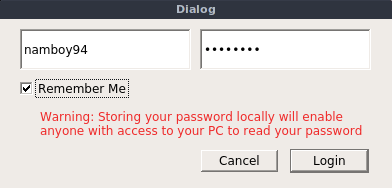
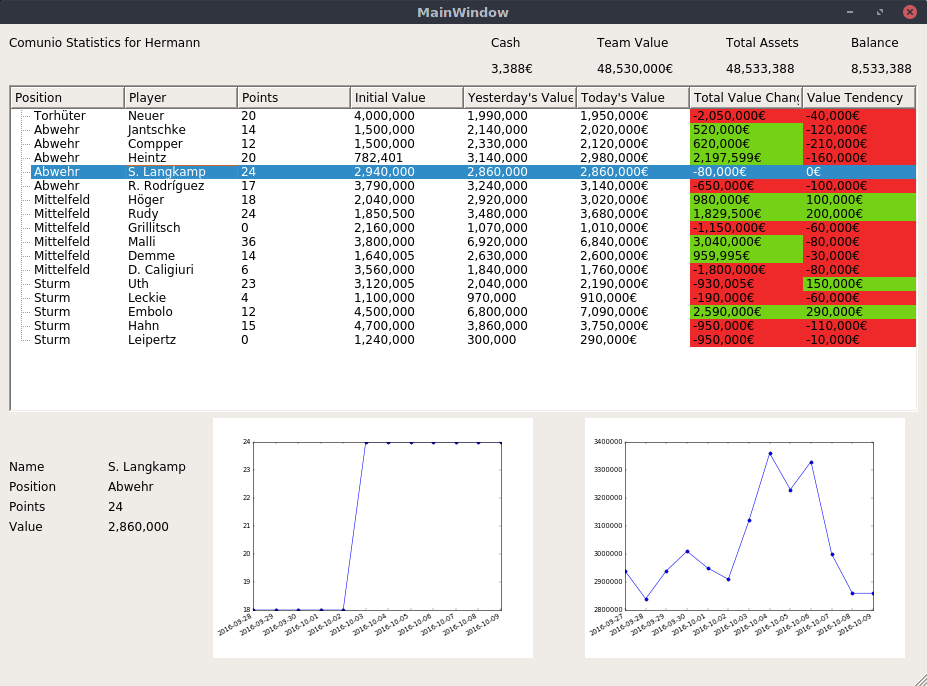
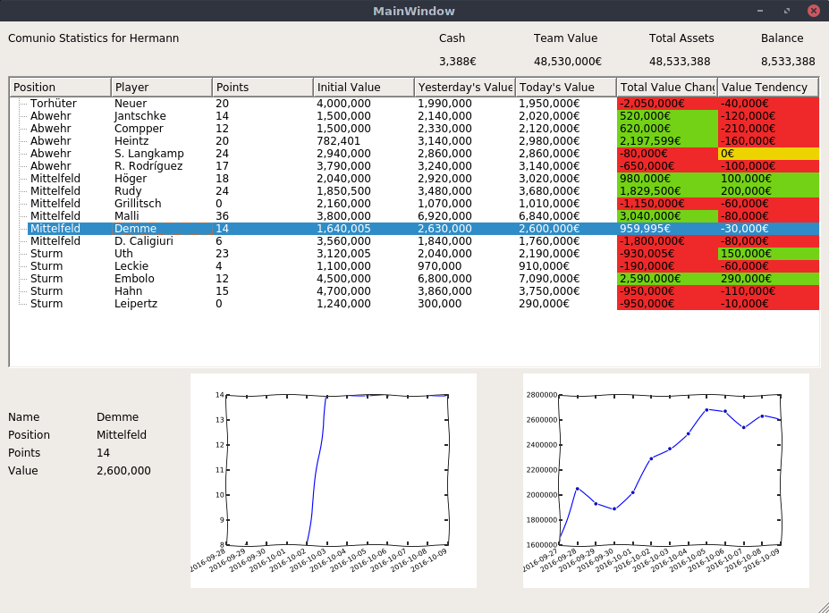
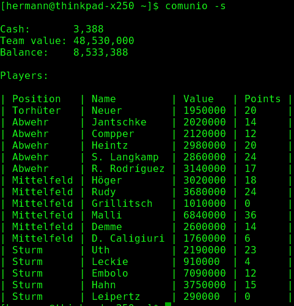

# Comunio Manager


Comunio Manager is a program designed to help Comunio players with managing their
teams by collecting information about their player's performance and market value.

This is accomplished by parsing the comunio.de website itself and storing the
parsed values in a local SQLite3 database.

## Installation

If you don't have python installed, please do so beforehand

If you have pip installed, you can simply run ```pip install comunio```
(or ```pip install comunio --user``` to install as non-root, which is probably
the preferred way to do it). 

If you can not use pip, you can also install the program by downloading the source
and running ```python setup.py install``` or ```python setup.py install --user```
in the root directory (which is the one containing a setup.py file)

Alternatively, Linux and Windows executables which require no additional dependencies
can be downloaded from the [Github release section](https://github.com/namboy94/comunio-manager/releases)

## Usage

The program offers the following command line arguments:

    -u , --username      Specifies the comunio username
    -p , --password      Specifies the comunio password
    -g , --gui           Starts the program in GUI mode
    -k , --keep_creds    Stores the provided credentials in a local config file
    -r , --refresh       Updates the local database, then exits the program
    -s , --summary       Prints a short summary of the player's account to the console
    -x , --xkcd          Draws the graphs in the GUI in an XKCD-comic style
    
### Examples

Running the program with the command

    comunio -u namboy94 -p hunter2 -sk
    
will make the program try to log in as the user 'namboy94' and the password
'hunter2'. Afterwards, a short summary of the player's comunio account will be printed
to the console. Since the -k flag was also set, the player's username and password
are stored locally, which enables the player to now just run

    comunio -r
    
and the local database will be updated. Please be aware of the fact that anyone 
with access to your local files will be able to read your credentials, so beware
of storing these on shared PCs.

The Program also offers a GUI, which can be called via

    comunio -g
    
It will start with a login screen, then proceed to displaying various information
about the comunio account and the (football) players in the (comunio) player's
team. For more details, view the screenshots section.

Additionally, the -x flag can be combined with the -g flag to show XKCD-style
graphs instead of normal graphs in the GUI

## Current Limitations

Due to the design of Comunio, the program has a couple of limitations:

  - When 5 players (the maximum amount) are up for sale, the database can not be updated,
    as it is not possible to determine the market values of the players that are not on sale
  - At times, the comunio servers do not allow logins from non-'Pro' players. At those times,
    the program can naturally not update the local database
  - The program can not get data from the past. Gaps in the database are compensated, but
    if no daily updates are done, gaps in the data will occur.

## Screenshots









## Further Information

[Documentation(HTML)](https://docs.namibsun.net/html_docs/comunio-manager/index.html)

[Documentation(PDF)](https://docs.namibsun.net/pdf_docs/comunio-manager.pdf)

[Python Package Index Site](https://pypi.python.org/pypi/comunio)

[Git Statistics (gitstats)](https://gitstats.namibsun.net/gitstats/comunio-manager/index.html)

[Git Statistics (git_stats)](https://gitstats.namibsun.net/git_stats/comunio-manager/index.html)

[Changelog](https://gitlab.namibsun.net/namboy94/comunio-manager/raw/master/CHANGELOG)